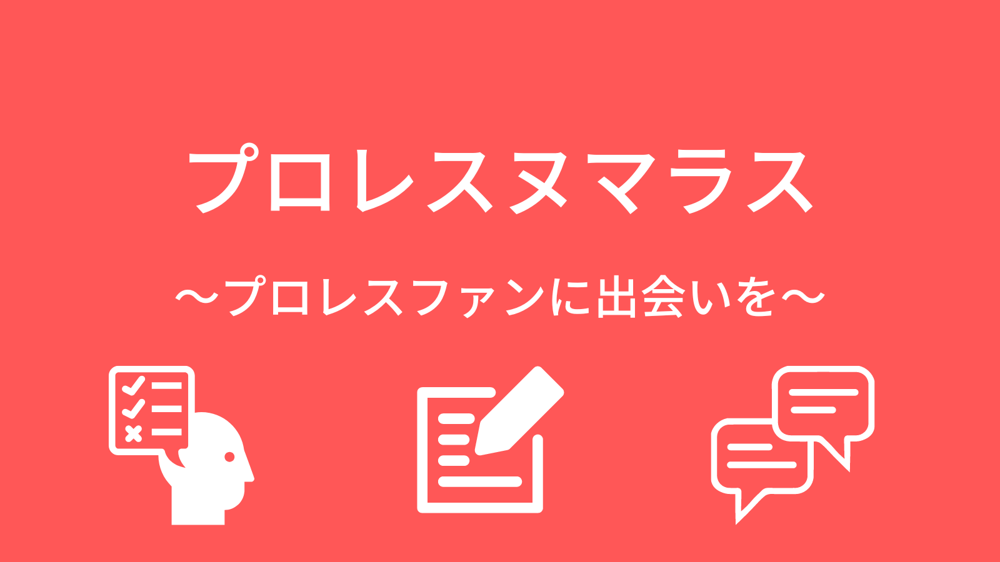

# プロレスヌマラス

## [プロレスヌマラス](https://prowrest-numarasu.herokuapp.com/)

## ■ サービス概要
プロレスを語り合いたいプロレスファンに 
楽しく交流できる場を提供する 
プロレス交流アプリ「プロレスヌマラス」です。

## ■メインのターゲットユーザー
- プロレスを語り合える場が欲しいプロレスファン
- プロレス仲間が欲しいプロレスファン

## ■ユーザーが抱える課題
- プロレスはあまりメジャーではないため、語り合いたいと思ってもプロレス好きな人が周りに少なかったり、いなかったりする
- プロレス仲間が欲しいが、作る場が少ない

## ■解決方法
「プロレスヌマラス」では、ユーザーにプロレスで交流ができるように主に3つの機能を実装しております。 
 
1.**投稿機能**→画像やYouTubeをアップロードし、感動したシーンや瞬間を共有することができます。またコメントすることもできるため、そこで交流することができます。 
2.**クイズ機能**→クイズを解いたり、作成することもできます。プロレスの知見や豆知識などをクイズにして、楽しく学んだり共有することができます。 
3.**グループチャット機能**→各団体や選手などのグループに作成・参加できるため、ユーザーが好きなグループに絞って交流することができます。

## ■制作した背景
私自身がプロレスがものすごく好きで、毎日YouTubeでプロレスの試合を見たり月に1回は必ず見に行ったりしています。
それだけでも楽しいと感じますが、その楽しさや試合で見た感動を共有したり、プロレスには人間ドラマやストーリーがあるためそれを考察するなどの語り合うことができる人があまりいないと感じています。
その原因としてはプロレスがあまりメジャーではないことと思い、Webを通じてであればプロレスファン同士が繋がって交流できるのではないかと思い、作成に至りました。

## ■サービスの紹介

サービス紹介ページ(上) | サービス紹介ページ(下)
-|-
 | 
ユーザー登録・ログイン、サービス説明 | サービスの使い方
| 
クイズの作成・検索・団体絞り込み | 選択形式のクイズ（選択肢は増減可能）
 | 
 投稿の作成・いいね・タグ付け・検索・団体絞り込み| 投稿の詳細・コメント
 | 
グループチャットの作成・参加・検索・団体絞り込み|チャット画面

 

## ■実装機能
- ユーザー登録機能
- ログイン・ログアウト機能
  - ユーザープロフィール編集機能
- クイズ一覧、作成、詳細、編集、削除機能
  - YouTube動画埋め込み機能
  - 画像投稿機能
  - 団体機能
  - 選択肢増減機能（cocoon）
  - twitterシェア機能
- 投稿一覧、作成、詳細、編集、削除機能
  - YouTube動画埋め込み機能
  - 画像投稿機能
  - 団体機能
  - タグ付け機能
  - コメント機能（JavaScriptによる非同期処理）
  - いいね機能(turbo_streamによる非同期処理)
  - いいね順並べ替え機能
- グループチャット一覧、作成、詳細、編集、削除機能
  - 画像投稿機能
  - 団体機能
  - チャット機能（ActionCableによるリアルタイムチャット）
  - グループ参加・退会機能
- 検索機能
  - 団体絞り込み機能
  - タグ名クリックによる絞り込み検索（投稿のみ）
  - タイトル・本文フリーワード検索

- いいね投稿一覧機能
- 利用規約・プライバシーポリシー・お問い合わせ
- ページネーション
- 管理者機能

## ■今後の追加実装予定
- Rspec
- パスワードリセット機能
- SNSログイン機能

 

## ■使用技術
**バックエンド**
 
- Ruby 3.1.2
- Ruby on Rails 7.0.4.2

**主要ライブラリ**
 
- turbo-rails
- stimulus-rails
- jbuilder
- sorcery
- seed-fu
- enum_help
- rails-i18n
- cssbundling-rails
- jsbundling-rails
- carrierwave(画像アップロード）
- cocoon（クイズの選択肢を増減）
- meta-tags(SEO)
- sitemap_generator(SEO)
- whenever
- rails_admin
- cancancan(権限管理）
- Rubocop(リントチェック)
- kaminari(ページネーション)
    
**フロントエンド**
 
- TailwindCSS
- DaisyUI
- JavaScript
- jQuery

**インフラ**
 
- Heroku
- PostgresQL

**その他**
 
- Google アナリティクス(GA4)

## ■画面遷移図
https://www.figma.com/file/dEzBkqlSeBIRtgNIopej9O/%E7%94%BB%E9%9D%A2%E9%81%B7%E7%A7%BB%E5%9B%B3?type=design&node-id=0%3A1&t=paLUUnDtVtYuv8UI-1

## ■ER図

